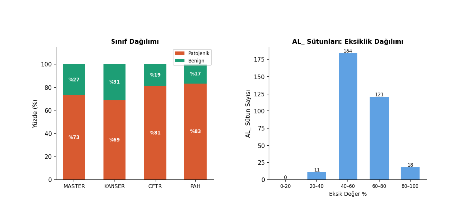
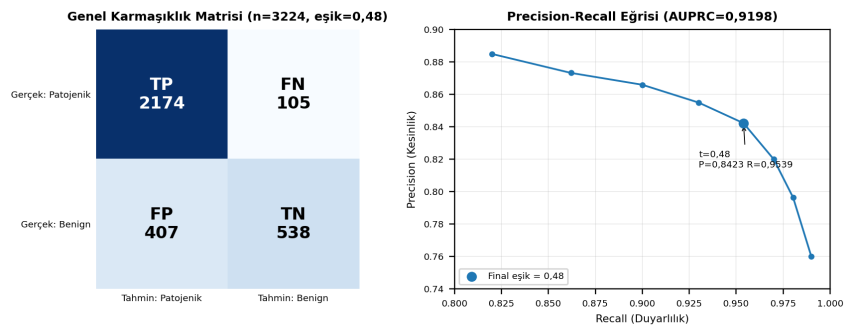
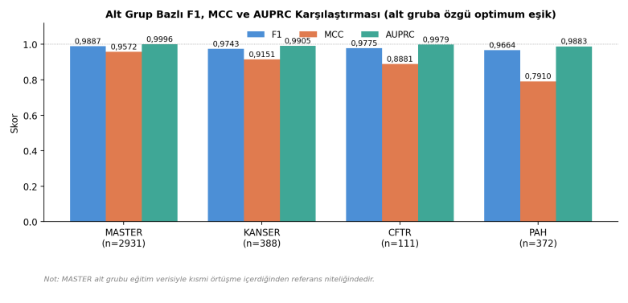
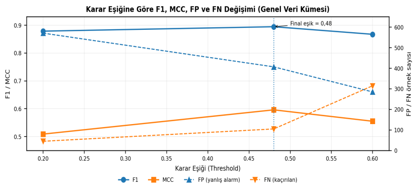
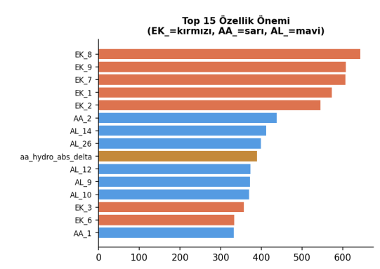

# Anonimleştirilmiş Tablo Verisiyle Missense Varyant Patojenite Tahmini

**TEKNOFEST 2026 Sağlıkta Yapay Zekâ Yarışması**

Bu depo, genomik koordinatı, gen adı ve protein yapı bilgisi gizlenmiş tablo verileri üzerinde
missense varyantları **patojenik / benign** olarak sınıflandıran makine öğrenmesi çalışmasının
kaynak kodunu içerir. Model tanı koymak için değil, klinik varyant yorumlama sürecinde karar
desteği sağlamak amacıyla geliştirilmiştir.

**Final sonuç (5 katlı birleşik OOF, n = 3224):** F1 = 0,8947 · MCC = 0,5961 · AUROC = 0,8618 · AUPRC = 0,9198

---

## İçindekiler

1. [Problem Tanımı](#1-problem-tanımı)
2. [Veri Kümesi](#2-veri-kümesi)
3. [Yöntem](#3-yöntem)
4. [Bulgular](#4-bulgular)
5. [Sonuç ve Değerlendirme](#5-sonuç-ve-değerlendirme)
6. [Sınırlılıklar](#6-sınırlılıklar)
7. [Depo Yapısı](#7-depo-yapısı)
8. [Kurulum ve Çalıştırma](#8-kurulum-ve-çalıştırma)
9. [Kaynakça](#9-kaynakça)

---

## 1. Problem Tanımı

Missense varyantlar, tek nükleotid değişiminin protein dizisinde amino asit ikamesine yol açtığı
genetik değişimlerdir. Bu değişimler protein katlanmasını, aktif bölge yapısını veya
protein-protein etkileşimlerini etkileyerek işlevsel hasara neden olabilir; ancak her missense
varyant hastalık yapıcı değildir.

Patojenik bir varyantın benign olarak sınıflandırılması tanı gecikmesine, benign bir varyantın
patojenik olarak sınıflandırılması ise gereksiz doğrulama testlerine yol açar. ACMG/AMP
varyantları patojenik, olası patojenik, önemi belirsiz (VUS), olası benign ve benign olarak
sınıflandırır [1]. ClinVar'da çok sayıda missense varyantın VUS statüsünde kalması hesaplamalı
tahmin yöntemlerine olan ihtiyacı artırmaktadır [2].

**Yarışma kısıtı.** Veri kümesi şifreli ve asimetriktir. Gerçek koordinatlar paylaşılmamıştır.
MASTER, KANSER, CFTR ve PAH alt grupları örnek sayısı, sınıf dağılımı ve biyolojik bağlam
bakımından farklılaşır. Bu nedenle model, klasik gen/pozisyon/yapı bilgileri yerine yalnızca
sağlanan özellik profilleri üzerinden karar verir.

**Değerlendirme metrikleri.** Eğitim kümelerinde patojenik sınıf baskın olduğundan doğruluk
(accuracy) tek başına yanıltıcıdır. Bu nedenle şu metrikler kullanılmıştır:

| Metrik | Neyi ölçer |
|---|---|
| F1 | Kesinlik ile duyarlılık arasındaki denge (ana optimizasyon ölçütü) |
| MCC | İki sınıfı simetrik ayırma başarısı; dengesiz veride en dürüst tek sayı |
| AUPRC | Dengesiz veride eşikten bağımsız precision-recall performansı |

Sonuçlar hem genel veri kümesi hem de MASTER, KANSER, CFTR ve PAH alt grupları için ayrı raporlanmıştır.

**Çalışmanın amacı:** Sınıf dağılımı dengesiz ve genomik koordinatı gizlenmiş veri kümelerinde
açıklanabilir, veri sızıntısı kontrollü ve dört alt grup genelinde genelleşebilen bir
sınıflandırma modeli geliştirmek.

## 2. Veri Kümesi

Her panel dosyasında 353 sütun bulunur (`Variant_ID`, 351 özellik, `Label`). Özellikler dört grupta ele alınmıştır:

| Grup | Sütun | İçerik | Model açısından rolü |
|---|---|---|---|
| `AL_` | 334 | Popülasyon alel frekansı (gnomAD, All of Us) | Benign varyant sinyali |
| `EK_` | 9 | İn silico patojenite skorları | Fonksiyonel risk sinyali |
| `CAT_` | 6 | Popülasyon / genotip / kalite bilgisi | Veri kalitesi ve grup bilgisi |
| `AA_` | 2 | Referans / alternatif amino asit | Biyokimyasal değişim sinyali |

Dört panel dosyası kısmen aynı varyantları içerir. Dosyalar birleştirilip `Variant_ID`
üzerinden tekilleştirildiğinde 3802 satırdan **3224 tekil varyant** (2279 patojenik, 945 benign)
elde edilir. Aynı varyantın farklı panellerde çelişkili etiket taşımadığı doğrulanmıştır.
Eğitim verisine dış kaynaklardan yeni etiketli varyant satırı eklenmemiştir.



*Şekil 1. Eğitim veri kümelerinin sınıf dağılımı (sol) ve AL_ özellik grubu eksiklik dağılımı (sağ). EK_ grubunda ortalama eksiklik oranı %17'dir.*

## 3. Yöntem

### 3.1. Eksik ve aykırı değer yönetimi

Sütun bazında eksiklik oranları hesaplanmış; `AL_` grubunda ortalama **%57**, `EK_` grubunda
ortalama **%17** eksiklik bulunmuştur.

- Eksik değerler **medyan imputation** ile tamamlanmıştır. Medyanlar veri sızıntısını önlemek
  için her çapraz doğrulama fold'unda yalnızca eğitim alt kümesinden öğrenilmiştir.
- `AL_` sütunlarında **sıfır doldurma kullanılmamıştır**. Bir frekansın eksik olması
  "gözlemlenmemiş", sıfır olması ise "frekans yok" anlamına gelir; ikisini eşitlemek benign
  sinyali yapay olarak bozar.
- `AL_` sütunlarının 0-1 aralığı dışına çıkmadığı doğrulanmış, sağa çarpık frekans
  değişkenlerinde log dönüşümü uygulanmıştır.
- `EK_` skorlarındaki uç değerler biyolojik anlam taşıyabileceğinden **kırpılmamış**,
  etkileri çapraz doğrulama sonuçlarıyla izlenmiştir.
- Tüm eğitim verisinde tek bir değer taşıyan (bilgi içermeyen) sütunlar modelden çıkarılmıştır.

### 3.2. Özellik mühendisliği

| Kaynak grup | Türetilen özellikler | Gerekçe |
|---|---|---|
| `AL_` | `al_filled_count`, `al_max_freq`, `al_log_max`, `al_n_pops_common` | Kaç popülasyonda gözlendiği ve en yüksek frekans, benign sinyalini tek değişkende özetler |
| `EK_` | `ek_mean`, `ek7_x_ek9` | Birden çok in silico skorun ortak eğilimi ve en güçlü iki skorun etkileşimi |
| `AA_` | hidrofobisite farkı, molekül ağırlığı farkı, polarite değişimi, stop kodon oluşumu | Amino asit ikamesinin biyokimyasal şiddeti |
| Panel | `is_PAH`, `is_CFTR`, `is_KANSER` | Kaynak panelin biyolojik bağlamını temsil eder |

`AA_` türevleri dış etiketli varyant verisinden değil, yalnızca sabit biyokimyasal ölçeklerden
(Kyte-Doolittle hidropati indeksi [14], molekül ağırlığı, polarite sınıfı) üretilmiştir. Test
verisinin panel dosyalarıyla sağlanacağı varsayıldığından panel değişkenleri veri sızıntısı
olarak değerlendirilmemiştir.

### 3.3. Sınıf dengesizliği stratejileri

| Strateji | Amaç | Karar |
|---|---|---|
| Baseline (ağırlıksız) | Referans model | Final aday modeller arasında temel referans olarak kullanıldı |
| `class_weight` | Azınlık sınıfını kayıp fonksiyonunda ağırlıklandırma | Tek başına en yüksek sonucu vermedi; ensemble bileşenlerinde değerlendirildi |
| SMOTE [15] | Azınlık sınıfını sentetik örneklerle artırma | AL_ eksiklik oranı ve frekans sinyalinin biyolojik anlamı nedeniyle final modele alınmadı |
| Bootstrap (PAH özel) | PAH eğitim alt kümesindeki benign örnek sayısını artırma (62 → 200) | Yalnızca eğitim fold'larında uygulandı; doğrulama fold'ları orijinal bırakıldı |

SMOTE, yüksek oranda eksik olan frekans sütunları arasında enterpolasyon yaparak biyolojik
karşılığı olmayan sentetik varyantlar üretmektedir; bu nedenle tercih edilmemiştir.

### 3.4. Algoritmalar

Final aday modeller **LightGBM** [16], **XGBoost** [17] ve **CatBoost** [18] olarak belirlenmiştir.
Bu yöntemler yüksek boyutlu tablo verisinde doğrusal olmayan ilişkileri yakalayabilmeleri,
sınıf ağırlığı desteği sunmaları ve SHAP ile açıklanabilirlik sağlamaları nedeniyle tercih
edilmiştir. Lojistik regresyon ve standart rastgele orman, özellik etkileşimlerini yakalama
kapasitesi sınırlı görüldüğünden önceliklendirilmemiştir.

| Algoritma | Ana parametre grubu | Gerekçe |
|---|---|---|
| LightGBM | num_leaves, min_child_samples, reg_alpha / reg_lambda | Yaprak bazlı büyüme; yüksek boyutlu, seyrek veride hızlı |
| XGBoost | max_depth, n_estimators, min_child_weight, reg_alpha / reg_lambda | Düzenlileştirme destekli, dayanıklı boosting |
| CatBoost | depth, iterations, learning_rate, l2_leaf_reg | Ordered boosting; aşırı uyum riski düşük |

### 3.5. Hiperparametre optimizasyonu

| Model | Yöntem | Arama uzayı |
|---|---|---|
| LightGBM | Optuna TPE, 60 trial, 3-fold CV | n_estimators 200-800, num_leaves 15-63, learning_rate 0,01-0,15, min_child_samples 5-40, subsample 0,6-1,0, colsample_bytree 0,5-1,0, reg_alpha / reg_lambda 1e-4-10 |
| XGBoost | Optuna TPE, 40 trial, 3-fold CV | max_depth 3-8, n_estimators 200-600, learning_rate 0,01-0,15, subsample 0,6-1,0, colsample_bytree 0,5-1,0, reg_alpha / reg_lambda 1e-4-5, min_child_weight 1-10 |
| CatBoost | Sabit konfigürasyon | depth = 6, iterations = 400, learning_rate = 0,05, l2_leaf_reg = 5; balanced ve ağırlıksız iki varyant karşılaştırıldı |

### 3.6. Çapraz doğrulama ve veri sızıntısı önlemleri

- Model değerlendirmesinde **5 katlı stratified cross-validation** kullanılmıştır.
- Eksik değer tamamlama, kategorik kodlama, bootstrap ve SHAP tabanlı özellik seçimi her fold
  içinde **yalnızca eğitim verisiyle** yürütülmüştür.
- Karar eşiği test setiyle değil, **out-of-fold (OOF) olasılıklarıyla** belirlenmiştir.
- Raporlanan genel değerler tüm katların birleşik OOF tahminlerinden hesaplanmıştır.

### 3.7. Aşırı uyum kontrolü

- Özellik sayısı SHAP ile **305'ten 50-59 aralığına** düşürülmüştür.
- `reg_alpha` / `reg_lambda` düzenlileştirmeleri kullanılmış, ağaç karmaşıklığı sınırlandırılmıştır.
- Performans tek bölünme yerine 5 katlı CV ile ölçülmüştür.
- Ensemble yapı tek modele bağımlılığı azaltmıştır.

### 3.8. Ensemble yapısı ve karar eşiği

Final model beş modelin **soft voting** (olasılık ortalaması) birleşimidir:

| Bileşen | Özellik seti |
|---|---|
| CatBoost, ağırlıksız | SHAP top-50 |
| CatBoost, `class_weight = balanced` | SHAP top-50 |
| LightGBM, num_leaves = 40, learning_rate = 0,05 | SHAP top-50 |
| LightGBM, Optuna parametreleri | SHAP top-59 |
| XGBoost, Optuna parametreleri | SHAP top-59 |

Karar eşiği OOF olasılıkları üzerinde 0,05-0,95 aralığında taranmış ve F1'i maksimize eden
eşik (**0,48**) seçilmiştir. Alt gruplar için ayrıca alt gruba özgü eşikler belirlenmiştir.

### 3.9. Açıklanabilirlik

Açıklanabilirlik için SHAP [19] kullanılmıştır. Global SHAP özellik önemini ve grup
katkılarını ölçmek, local SHAP ise hatalı sınıflandırılan örneklerde kararın hangi sinyallerden
kaynaklandığını incelemek için uygulanmıştır.

## 4. Bulgular

### 4.1. Model konfigürasyonu karşılaştırması

| No | Model | Özellik | Strateji | CV F1 | CV MCC | CV AUPRC |
|---|---|---|---|---|---|---|
| 1 | LightGBM | 305 | Baseline (ağırlıksız) | 0,8854 | 0,5044 | 0,9158 |
| 2 | LightGBM | 305 | class_weight = balanced | 0,8732 | 0,5060 | 0,9157 |
| 3 | LightGBM | 305 | SMOTE 1:1 | 0,8751 | 0,5036 | 0,9164 |
| 4 | LightGBM | 305 | SMOTE 2:1 | 0,8844 | 0,5043 | 0,9156 |
| 5 | LightGBM | 50 | SHAP top-50; num_leaves = 40; lr = 0,05 | 0,8865 | 0,5688 | 0,9171 |
| 6 | CatBoost | 50 | SHAP top-50, class_weight = balanced | 0,8606 | 0,5589 | 0,9088 |
| 7 | CatBoost | 50 | SHAP top-50, ağırlıksız, depth = 6 | 0,8900 | 0,5766 | 0,9233 |
| 8 | XGBoost | 305 | Optuna TPE 40 trial; tekil CV metrik kaydı yok | - | - | - |
| 9 | **5-Model Ensemble** | 50/59 | Soft voting (2×CatBoost, 2×LightGBM, 1×XGBoost) | **0,8947** | **0,5961** | 0,9198 |

Tablodan çıkan başlıca gözlemler:

- 305 özellikle yapılan dengesizlik denemelerinde (1-4) class_weight ve SMOTE baseline'a göre
  anlamlı bir iyileşme sağlamamıştır.
- SHAP ile 50 özelliğe inmek MCC'yi 0,50 düzeyinden 0,57 düzeyine çıkarmıştır; gürültülü
  özelliklerin elenmesi benign sınıfın ayrımını belirgin şekilde iyileştirmiştir.
- En yüksek tekil sonuç ağırlıksız CatBoost ile elde edilmiştir.
- Ensemble, en iyi tekil modele göre F1'de sınırlı, MCC'de daha belirgin bir artış sağlamıştır.

### 4.2. Final modelin genel başarımı

Genel veri kümesi üzerinde birleşik OOF başarımı (n = 3224, eşik = 0,48):

| F1 | MCC | AUROC | AUPRC | Precision | Recall (Duyarlılık) | Specificity (Özgüllük) |
|---|---|---|---|---|---|---|
| 0,8947 | 0,5961 | 0,8618 | 0,9198 | 0,8423 | 0,9539 | 0,5693 |

Karmaşıklık matrisi TP = 2174, FN = 105, FP = 407, TN = 538'dir. Model patojenik sınıfı yüksek
duyarlılıkla yakalamakta, benign sınıfta ise yanlış pozitif üretme eğilimi göstermektedir.



*Şekil 2. Genel veri kümesi karmaşıklık matrisi ve Precision-Recall eğrisi.*

### 4.3. Alt grup bazlı bulgular

Aşağıdaki değerler bağımsız test performansı değil, tüm eğitim verisiyle eğitilmiş modelin
panel dosyaları üzerindeki uygulama skorudur. Paneller kısmi `Variant_ID` örtüşmesi
içerdiğinden alt grup n toplamı genel n ile toplanmamalıdır. Genel genelleme başarımı için
Bölüm 4.2'deki OOF sonuçları esas alınmalıdır.

| Alt grup | n | Eşik | F1 | MCC | AUROC | AUPRC | TP | TN | FP | FN |
|---|---|---|---|---|---|---|---|---|---|---|
| MASTER | 2931 | 0,53 | 0,9887 | 0,9572 | 0,9989 | 0,9996 | 2147 | 735 | 47 | 2 |
| KANSER | 388 | 0,16 | 0,9743 | 0,9151 | 0,9822 | 0,9905 | 265 | 109 | 11 | 3 |
| CFTR | 111 | 0,21 | 0,9775 | 0,8881 | 0,9905 | 0,9979 | 87 | 20 | 1 | 3 |
| PAH | 372 | 0,22 | 0,9664 | 0,7910 | 0,9527 | 0,9883 | 302 | 49 | 13 | 8 |



*Şekil 3. Alt grup bazlı panel F1, MCC ve AUPRC karşılaştırması.*

### 4.4. Karar eşiği

Ana optimizasyon ölçütü F1 olarak alınmış, MCC ve AUPRC ikincil genelleme ölçütleri olarak
izlenmiştir. Eşik yükseldikçe yanlış pozitifler azalmakta, yanlış negatifler artmaktadır.

| Eşik | F1 | MCC | Precision | Recall | FP | FN |
|---|---|---|---|---|---|---|
| 0,20 | 0,8788 | 0,5090 | 0,7964 | 0,9803 | 571 | 45 |
| **0,48** | **0,8947** | **0,5961** | 0,8423 | 0,9539 | 407 | 105 |
| 0,60 | 0,8675 | 0,5552 | 0,8733 | 0,8618 | 285 | 315 |



*Şekil 4. Karar eşiğine göre F1, MCC, FP ve FN değişimi.*

### 4.5. Açıklanabilirlik (SHAP)

- En yüksek katkıya sahip ilk beş özellik `EK_8`, `EK_9`, `EK_7`, `EK_1` ve `EK_2`'dir.
- Toplam 305 özelliğin 67'si sıfır SHAP değeri taşımaktadır.
- İlk 50 özellik toplam SHAP katkısının %80'ini oluşturmaktadır; bu bulgu top-50 özellik
  seçiminin gerekçesidir.

| Özellik grubu | Toplam SHAP katkısı |
|---|---|
| `AL_` | %61,5 |
| `EK_` | %21,2 |
| `AA_` ve türevleri | %9,4 |
| Mühendislik özellikleri | %6,0 |
| `CAT_` | %1,9 |



*Şekil 5. SHAP analizinde ilk 15 özelliğin ortalama mutlak katkı değerleri.*

### 4.6. PAH alt grubuna özel strateji

PAH eğitim alt kümesinde yalnızca 62 benign ve 310 patojenik örnek bulunmaktadır. Benign
örnek azlığı nedeniyle PAH en zayıf alt grup olmuş ve ayrıca ele alınmıştır.

| Strateji | Eşik | F1 | MCC | AUROC | AUPRC | FP | FN |
|---|---|---|---|---|---|---|---|
| Genel model, referans eşik | 0,42 | 0,9468 | 0,7315 | 0,9527 | 0,9883 | 7 | 25 |
| Genel model, PAH özel eşik | 0,22 | 0,9664 | 0,7910 | 0,9527 | 0,9883 | 13 | 8 |
| Eğitimde bootstrap (62 → 200) + PAH özel eşik | 0,09 | 0,9774 | 0,8645 | 0,9889 | 0,9979 | 7 | 7 |

PAH'a özel eşik MCC'yi 0,7315'ten 0,7910'a, eğitim fold'larında uygulanan bootstrap ise
0,8645'e yükseltmiştir. Bootstrap yalnızca eğitim fold'larında uygulanmış, doğrulama fold'ları
orijinal bırakılmıştır. Bu sonuç genel OOF skoruna değil, PAH özel strateji analizine aittir.

## 5. Sonuç ve Değerlendirme

Bu çalışmada genomik koordinat ve protein yapı bilgisi kullanılmadan, şifrelenmiş tablo
özellikleriyle missense varyant patojenite tahmini yapılmıştır. Final ensemble model birleşik
5 katlı OOF değerlendirmesinde **F1 = 0,8947, MCC = 0,5961, AUROC = 0,8618 ve AUPRC = 0,9198**
değerlerine ulaşmıştır. Çalışmanın temel katkısı, koordinat bilgisi gizli veri üzerinde eşik
optimizasyonu ve SHAP tabanlı açıklanabilirlik içeren bir sınıflandırma yaklaşımı sunmasıdır.

**Güçlü yönler**

- Gradient boosting modelleri `AL_`, `EK_`, `CAT_` ve `AA_` gibi heterojen özellik grupları
  arasındaki doğrusal olmayan ilişkileri etkili şekilde yakalamıştır.
- SHAP tabanlı özellik seçimi boyutu 305'ten 50-59 aralığına düşürmüş, MCC'yi belirgin şekilde
  artırmıştır.
- Ensemble yapı tek modele bağımlılığı azaltmıştır.
- Alt gruba özgü eşikler özellikle KANSER ve PAH gruplarında global eşiğe göre daha yüksek MCC sağlamıştır.

**Zayıf yönler ve hata profili**

- Modelin başlıca zayıflığı benign varyantları patojenik sınıflandırma eğilimidir (FP = 407, FN = 105).
- Yanlış pozitifler ağırlıklı olarak **yüksek EK_ skoru taşıyan benign varyantlarda**, yanlış
  negatifler ise **AL_ bilgisi eksik veya fonksiyonel sinyali zayıf patojenik varyantlarda**
  yoğunlaşmaktadır.

**Klinik yorum.** Yanlış negatifler tanı gecikmesi riski nedeniyle daha kritiktir; yanlış
pozitifler ise gereksiz doğrulama testi ve klinik iş yükü açısından önemlidir. SHAP'ta `AL_` ve
`EK_` gruplarının üst sıralarda yer alması, model kararlarında popülasyon frekansı ve in silico
risk skorlarının belirleyici olduğunu göstermektedir.

**Literatürdeki konumu.** Sonuçlar aynı veri kümesinde değerlendirilmediği için REVEL [6],
CADD [7], AlphaMissense [8] veya ClinPred [13] ile doğrudan karşılaştırılmamalıdır. Çalışma,
çoklu in silico skor ve alel frekansını birleştiren tablo tabanlı yaklaşımlara yöntemsel olarak
yakındır. AlphaMissense ve PrimateAI-3D [11] yapı ve evrimsel bağlamdan yararlanırken bu
çalışmada koordinat ve yapı bilgisi bulunmadığından başarı, anonimleştirilmiş tablo verisi
kısıtı içinde değerlendirilmelidir.

## 6. Sınırlılıklar

- Gen kimliği, kromozomal pozisyon, protein bölgesi ve 3B yapı bilgisi kullanılamamıştır.
- PAH'ta benign örnek azlığı modelin benign profili öğrenmesini sınırlamıştır. Bootstrap
  temsili artırsa da yeni biyolojik çeşitlilik üretmez.
- XGBoost'un tekil CV metrikleri ayrı bir çıktı dosyasına kaydedilmemiştir.
- Alt grup panel skorları bağımsız test veya OOF sonucu değildir.
- Test aşamasındaki başlıca riskler: dağılım farkı, PAH'taki düşük eşiğin yanlış pozitifleri
  artırması, panel eşiklerine bağımlılık ve test verisinde AL_ eksikliğinin artması.

Model klinik kararın yerine geçmez; yalnızca varyant önceliklendirme ve karar desteği amacıyla
kullanılmalıdır.

## 7. Depo Yapısı

```
.
├── src/
│   ├── config.py            # yollar, sabitler, sabit hiperparametreler
│   ├── data.py              # veri yükleme, tekilleştirme, panel değişkenleri
│   ├── features.py          # sabit sütun temizliği ve özellik mühendisliği
│   ├── preprocessing.py     # fold içi medyan imputation ve kategorik kodlama
│   ├── metrics.py           # F1, MCC, AUROC, AUPRC ve eşik taraması
│   ├── models.py            # LightGBM, XGBoost, CatBoost ve soft voting ensemble
│   ├── selection.py         # SHAP önem hesabı ve özellik seçimi
│   ├── tuning.py            # Optuna TPE
│   ├── pipeline.py          # veri hazırlama ve sızıntısız CV döngüsü
│   └── plots.py             # şekiller
├── scripts/
│   ├── 01_eda.py                    # veri yapısı, eksiklik analizi, Şekil 1
│   ├── 02_imbalance_experiments.py  # dengesizlik stratejileri (Tablo, satır 1-4)
│   ├── 03_optuna_lgbm.py            # LightGBM Optuna
│   ├── 04_optuna_xgb.py             # XGBoost Optuna
│   ├── 05_shap_selection.py         # SHAP analizi ve top-50 deneyleri, Şekil 5
│   ├── 06_ensemble_oof.py           # ensemble OOF, eşik analizi, Şekil 2 ve 4
│   ├── 07_final_train_panels.py     # final model ve alt grup skorları, Şekil 3
│   ├── 08_pah_strategy.py           # PAH özel strateji
│   └── 09_error_analysis.py         # hata profili ve local SHAP
├── docs/figures/            # README şekilleri
├── predict.py               # yeni panel dosyası için tahmin
├── run_all.py               # tüm hattı sırayla çalıştırır
└── requirements.txt
```

## 8. Kurulum ve Çalıştırma

Yarışma verisi bu depoda paylaşılmamaktadır. Eğitim dosyaları (`YARISMA_TRAIN_MASTER.csv`,
`YARISMA_TRAIN_KANSER.csv`, `YARISMA_TRAIN_CFTR.csv`, `YARISMA_TRAIN_PAH.csv`) proje kök
dizinindeki `data/` klasörüne yerleştirilmelidir.

```bash
pip install -r requirements.txt
python run_all.py
```

Belirli adımları çalıştırmak için adım numaraları verilebilir:

```bash
python run_all.py 05 06
```

Adımlar arası bağımlılıklar: `06` adımı `03`, `04` ve `05` adımlarının çıktılarını; `07` adımı
`06` adımının global eşiğini; `08` ve `09` adımları ise `07` adımında kaydedilen final modeli
kullanır. Tüm çıktılar (tablolar, şekiller, modeller) `outputs/` klasörüne yazılır. Tüm
adımlarda `SEED = 42` kullanılır; kütüphane sürümlerine bağlı küçük sayısal farklar oluşabilir.

Test verisi için tahmin:

```bash
python predict.py --input YARISMA_TEST_PAH.csv --panel PAH --output tahmin_PAH.csv
```

Varsayılan olarak alt gruba özgü eşik kullanılır; `--threshold-mode global` ile OOF üzerinden
belirlenen global eşik (0,48) kullanılabilir.

## 9. Kaynakça

1. S. Richards ve ark., "Standards and guidelines for the interpretation of sequence variants: a joint consensus recommendation of the American College of Medical Genetics and Genomics and the Association for Molecular Pathology," *Genet. Med.*, 17(5), 405-424, 2015. doi: 10.1038/gim.2015.30
2. M. J. Landrum ve ark., "ClinVar: improving access to variant interpretations and supporting evidence," *Nucleic Acids Res.*, 46(D1), D1062-D1067, 2018. doi: 10.1093/nar/gkx1153
3. K. J. Karczewski ve ark., "The mutational constraint spectrum quantified from variation in 141,456 humans," *Nature*, 581(7809), 434-443, 2020. doi: 10.1038/s41586-020-2308-7
4. D. R. Riggs ve ark., "ClinGen: the Clinical Genome Resource," *N. Engl. J. Med.*, 372(23), 2235-2242, 2015. doi: 10.1056/NEJMsr1406261
5. All of Us Research Program Genomics Investigators, "Genomic data in the All of Us Research Program," *Nature*, 627, 340-346, 2024. doi: 10.1038/s41586-023-06957-x
6. N. M. Ioannidis ve ark., "REVEL: An Ensemble Method for Predicting the Pathogenicity of Rare Missense Variants," *Am. J. Hum. Genet.*, 99(4), 877-885, 2016. doi: 10.1016/j.ajhg.2016.08.016
7. P. Rentzsch, D. Witten, G. M. Cooper, J. Shendure, M. Kircher, "CADD: predicting the deleteriousness of variants throughout the human genome," *Nucleic Acids Res.*, 47(D1), D886-D894, 2019. doi: 10.1093/nar/gky1016
8. J. Cheng ve ark., "Accurate proteome-wide missense variant effect prediction with AlphaMissense," *Science*, 381(6664), eadg7492, 2023. doi: 10.1126/science.adg7492
9. H. Qi ve ark., "MVP predicts the pathogenicity of missense variants by deep learning," *Nat. Commun.*, 12(1), 510, 2021. doi: 10.1038/s41467-020-20847-0
10. J. Frazer ve ark., "Disease variant prediction with deep generative models of evolutionary data," *Nature*, 599(7883), 91-95, 2021. doi: 10.1038/s41586-021-04043-8
11. H. Gao ve ark., "The landscape of tolerated genetic variation in humans and primates," *Science*, 380(6648), eabn8153, 2023. doi: 10.1126/science.abn8197
12. V. Pejaver ve ark., "Inferring the molecular and phenotypic impact of amino acid variants with MutPred2," *Nat. Commun.*, 11(1), 5918, 2020. doi: 10.1038/s41467-020-19669-x
13. Y. Alirezaie, K. D. Kernohan, T. Hartley, K. M. Boycott, D. R. Martelotto, "ClinPred: Prediction Tool to Identify Disease-Relevant Nonsynonymous Single-Nucleotide Variants," *Am. J. Hum. Genet.*, 103(4), 474-483, 2018. doi: 10.1016/j.ajhg.2018.08.005
14. J. Kyte, R. F. Doolittle, "A simple method for displaying the hydropathic character of a protein," *J. Mol. Biol.*, 157(1), 105-132, 1982. doi: 10.1016/0022-2836(82)90515-0
15. N. V. Chawla, K. W. Bowyer, L. O. Hall, W. P. Kegelmeyer, "SMOTE: Synthetic Minority Over-sampling Technique," *J. Artif. Intell. Res.*, 16, 321-357, 2002. doi: 10.1613/jair.953
16. G. Ke ve ark., "LightGBM: A Highly Efficient Gradient Boosting Decision Tree," *Adv. Neural Inf. Process. Syst.*, 30, 3146-3154, 2017.
17. T. Chen, C. Guestrin, "XGBoost: A Scalable Tree Boosting System," *Proc. 22nd ACM SIGKDD Int. Conf. Knowl. Discov. Data Min.*, 785-794, 2016. doi: 10.1145/2939672.2939785
18. L. Prokhorenkova, G. Gusev, A. Vorobev, A. V. Dorogush, A. Gulin, "CatBoost: unbiased boosting with categorical features," *Adv. Neural Inf. Process. Syst.*, 31, 6638-6648, 2018.
19. S. M. Lundberg, S.-I. Lee, "A Unified Approach to Interpreting Model Predictions," *Adv. Neural Inf. Process. Syst.*, 30, 4765-4774, 2017.
